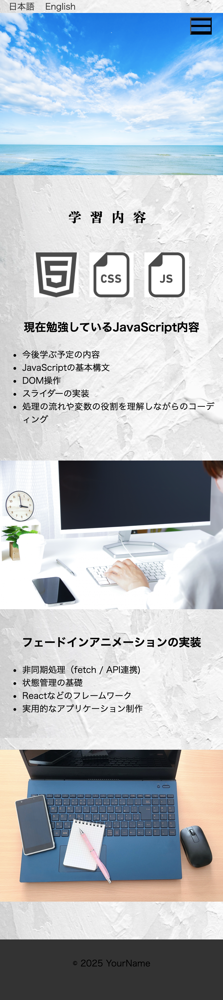

## Web制作ポートフォリオサイト - 会社提出用（2025年4月作成）

## 概要

このポートフォリオサイトを作成した理由は以下の通りです。  
- これまでに身につけたコーディングとプログラミングのスキルが、ゼロからサイトを構築する中でどこまで通用するのかを試したかったため。
- 自分で書いたコードを添削してもらうことで、コードの可読性や他の実装方法を学べると考えたため。  
- 1からサイトを作成し、自分で定めた提出日を守ることが、自信につながると感じたため。

## 使用技術

- HTML5  
- CSS3（Flexbox / Grid / アニメーション / メディアクエリ）  
- JavaScript（DOM操作 / スライダー機能 / 言語切り替え / アニメーション制御 ※関数・イベント処理など含む） 
- Git / GitHub  
- レスポンシブデザイン対応（スマートフォン・タブレット・PC対応）

## 機能一覧

- フェードインスライダー（JavaScriptで実装）
- 自作の横スライダー（ホバー時の拡大・自動再生・インジケーター付き）
- 言語切り替え機能（日本語⇔英語）
- フェードインアニメーション（セクション単位）
- ハンバーガーメニュー（SP表示時のみ）
- レスポンシブ対応（スマートフォン / タブレット / PC）

## 工夫した点・学んだこと

- JavaScriptでライブラリを使わず、スライダーやアニメーションを一から実装したことで、DOM操作やイベント処理への理解が深まった。
- モバイルファーストでコーディングを行い、各デバイスで最適なレイアウトになるようレスポンシブ対応を徹底した。
- 言語切り替え機能を通じて、オブジェクト操作や関数の再利用性について学ぶことができた。
- セクションごとのフェードイン演出やホバーアニメーションを取り入れ、ユーザーにとって動きのある印象的なサイトに仕上げた。
- コードがスパゲッティ化しないように、**見やすく整理された構造と可読性**を意識して記述した。
- コードを書く際は処理の動きや仕組みを**検索やChatGPTで調べながら、一つひとつ丁寧に理解する姿勢**を大切にした。
- 提出期限を設定し、スケジュールを意識して作業を進めたことで、実務を想定した開発フローを体験できた。

 ## 今後の改善点

- JavaScriptコードのモジュール化や、よりスマートな記述方法への最適化
- クラス名やID名の命名規則（BEMなど）に沿った統一的な設計
- 共通パーツのHTML化（ヘッダーやフッターなど）による再利用性の向上
- アクセシビリティへの対応（alt属性の適切な設定やキーボード操作対応など）
- CSS設計（SassやCSS設計手法の導入）による保守性の向上
- GitHub上のコミットメッセージの整理と履歴の見直し
- 将来的には、ReactやVueなどのフレームワークを用いた構築にも挑戦したい

## スクリーンショット

### PC表示

### タブレット表示

### スマートフォン表示

## ミニアプリ紹介

### 📝 メモアプリ（app/memo）

- localStorage を使ったシンプルなメモ保存アプリです。
- タイトルと内容を入力して保存・表示・削除ができます。
- JavaScriptのDOM操作・オブジェクト・イベント・localStorageの復習目的で作成。

## ナビゲーションリンクについて

本サイト内の一部ナビゲーションリンクは、現在未作成のページを示しています。  
本案件ではHTML/CSS/JavaScriptの基本的な実装を中心に構成し、  
コンテンツの構造や動的な処理部分に注力することを目的としたため、  
ページ数を必要最小限に絞って制作を行いました。

## ご意見・アドバイスをいただきたいポイント

- JavaScriptの書き方や構成において、より適切・効率的な実装方法があればご指摘いただけると嬉しいです。
- コードの可読性・idとクラスの命名の仕方・ファイルの分割方法・実務において意識する点があればアドバイスをお願いします。

ここまで読んでいただきありがとうございました。